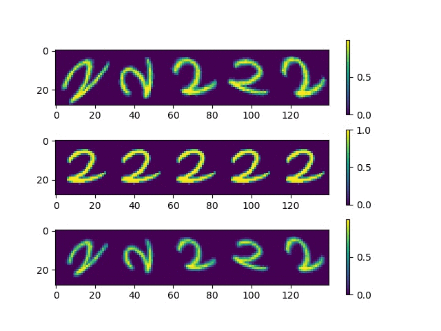

#### Affine registration with spatial transformer networks
Implemented on tf.keras (TensorFlow 1.14)

##### Todo
* Readme
* Fix interpolation of boundary pixels

##### Visualization
Learning progress on held out images

