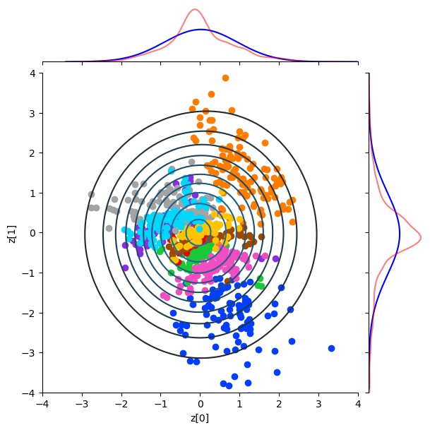
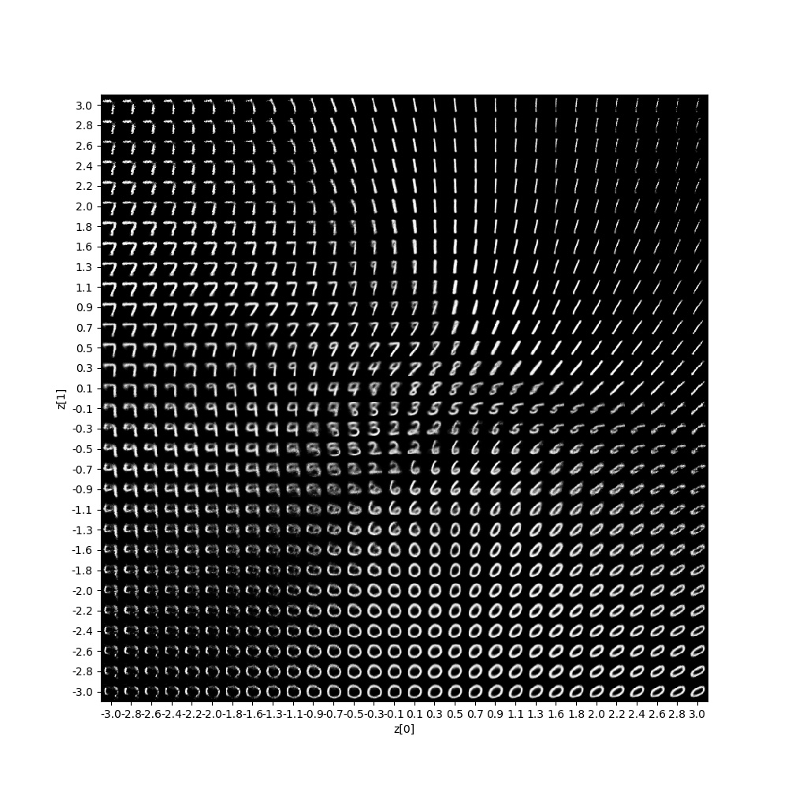

###### Variational autoencoder (TF 2.1)

* References:
1. Kingma, Diederik P., and Max Welling. "Auto-encoding variational bayes." arXiv preprint arXiv:1312.6114 (2013).

2. https://en.wikipedia.org/wiki/Variational_Bayesian_methods#Mathematical_derivation

* Visualization:

MNIST posterior samples (contour denotes a standard normal distribution)

 |